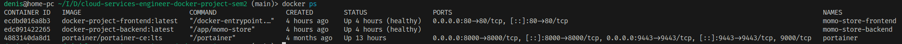

# "Cloud Services Engineer Docker Project Sem2"

Учебный проект по курсу "Cloud Services Engineer", Docker-контейнеризация и хранение данных.


## Требования

- **Docker >= 20.10**
- **Docker Compose >= 1.29**
- **Git**

---

## Установка и запуск

1. Клонировать репозиторий

https://github.com/msmkdenis/cloud-services-engineer-docker-project-sem2


2. Запустить проект со сборкой
```bash
docker-compose up --build -d
```

3. Проверить запущенные контейнеры
```bash
docker ps
```
4. Ожидаемый результат:



- Frontend: http://localhost:80

## Оптимизация

- **Уменьшение веса образов:** alpine образы, multi-stage build.
- **Ограничения ресурсов:** в `docker-compose.yml` задаются лимиты CPU и памяти.
- **Сеть:** контейнеры объединяются в общую сеть через `networks`.
- **Порты:** `ports` определяет доступ из контейнера наружу.
- **Ограниченные права:** `cap_drop` и `cap_add` ограничивают набор привилегий.
- **Healthcheck:** проверяет работоспособность контейнеров.
- **Trivy:** для проверки уязвимостей в образах.
